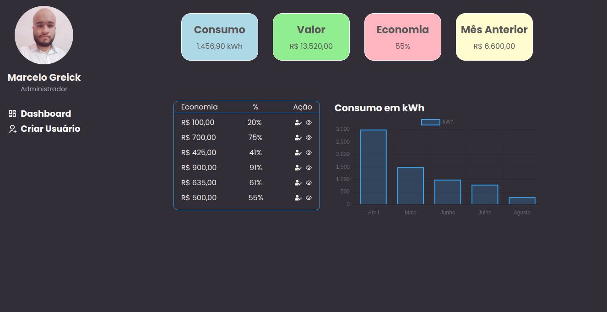

## Projeto

Teste desenvolvido para a [Sunne](https://www.sunne.com.br/). <br />

## Tecnologias utilizadas 🚀

<ul>
    <li><a href="https://reactjs.org/" target="_blank">React.js</a></li>
    <li><a href="https://www.typescriptlang.org/" target="_blank">TypeScript</a></li>
    <li><a href="https://nextjs.org/" target="_blank">Next.Js</a></li>
    <li><a href="https://sass-lang.com/" target="_blank">Sass</a></li>
</ul>


<br />



## Executar a aplicação

Em caso de download do projeto você precisará baixar as dependências:

**Necessário:** Yarn , utileze Yarn install

<ul>
 <li>Para iniciar o projeto, siga os passos abaixo:</li>
</ul>

```
1 - Primeiro abra no terminal a pasta do backend e execute yarn dev
2 - Dentro desta aplicação frontend execurte yarn dev
```

## Estrutura Next.Js

<p>1 - Escolhi o Next.Js para fazer o teste é uma ferramenta nova que aprendi e estou gostando bastante juntamente com Typescript</p>
<p>2 - Na Pasta Public está todas as imagens da aplicação, no Next tudo que está na pasta public acessivel para todas a aplicação</p>
<p>3 - Dentro de Src está todas as paginas, componentes, configuração de acesso a api, estilos</p>
<p>3 - Cada componete dentro da Pages no Next é uma rota da aplicação</p>

## Paginas

<p>
1 - Login: Na página de login eu tenho uma imagem no canto direto que vai ser ajustando conforme as dimnensões na tela,<br/>
tem um formulario que está submetido a um funcão que manda um post para api com email e senha pega a resposta e seta os<br/>
dados no cookies para autenticação, o formulario importa o componete de input que geralmente eu utilizo esse modelo de input<br/>
que aprendi , as tipagens as propriedades que ele recebe, costumo usar como modelo, tem um Sweetalert caso senha ou email for<br/>
digitado errado.
</p>


